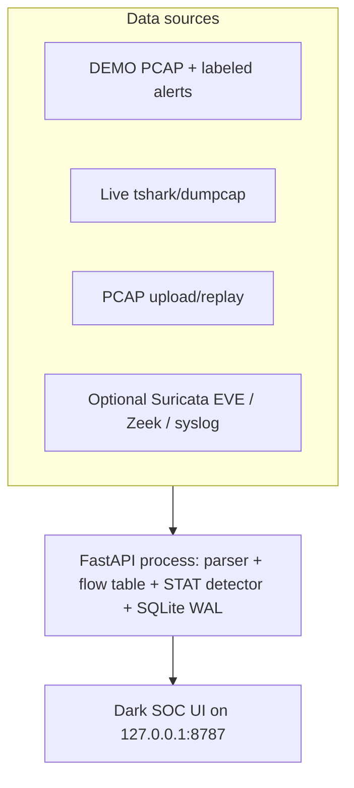

# 9yards NIDS — Network Intrusion Detection + Statistical Analytics

Defensive SOC / lab dashboard for **Kali Linux**: packet metadata, bidirectional flows, IDS alerts, and supporting statistics. Monitoring and detection only. No exploit payloads, no attack how-tos.

Workspace: `/mnt/5TB/git/9yards`

## Architecture (short)



Full write-up: [docs/ARCHITECTURE.md](docs/ARCHITECTURE.md)  
Operator hunts: [docs/OPERATOR.md](docs/OPERATOR.md)  
Gaps / hardening: [docs/LIMITATIONS.md](docs/LIMITATIONS.md)

**Why this stack:** this Kali has tshark/dumpcap (user is in `wireshark`, dumpcap has `cap_net_raw`). Suricata and Zeek are **not** installed. FastAPI + SQLite is enough to demo a serious NIDS/stat dashboard without Elasticsearch.

## Data model

| Store | Fields |
| --- | --- |
| `packets` | ts, MACs, VLAN, 5-tuple, proto, length, TCP flags, TTL, L7, SNI, JA3, retrans, info |
| `flows` | orig/resp 5-tuple, pkts/bytes each way, duration, TCP state/flags, RST/retrans, initiator |
| `alerts` | severity, SID, signature, category, 5-tuple, count, first/last, source, DEMO flag, ack/mute/comment |
| `stats_ts` | pps, bps, flows, alert rate, unique hosts, drops/errors |
| `hosts` | bytes/packets in/out, ports, alert count |

Payloads are **not** stored unless `NIDS_STORE_PAYLOAD=1` (hex/ASCII cap).

## Pages

Overview · Packets · Flows · Alerts · Protocols · Hosts · Settings

Global time picker (5m / 15m / 1h / 6h / 24h), search, auto-refresh with pause, CSV/JSON export, empty/error states.

## Install + run (Kali)

```bash
cd /mnt/5TB/git/9yards
chmod +x start.sh scripts/*.sh
./start.sh
```

That will:

1. Create `.venv` and install `fastapi`, `uvicorn`, `python-multipart`
2. Generate `sample/lab-demo.pcap` + EVE/Zeek samples and load them into `data/nids.db`
3. Bind **http://127.0.0.1:8787/**

```bash
# health
curl -s http://127.0.0.1:8787/api/health | python3 -m json.tool
```

### Manual steps (same thing, split)

```bash
cd /mnt/5TB/git/9yards
python3 -m venv .venv
source .venv/bin/activate
pip install -r requirements.txt

# generate / load DEMO (safe to re-run; --ensure skips if packets already exist)
python -m nids.demo --ensure
# force replace:
python -m nids.demo --force

python -m nids
# → http://127.0.0.1:8787/
```

### Live sensor path

Requires group `wireshark` (already true on this host) **or** root. Live capture is off by default.

```bash
# from the UI: Settings → pick iface → Start live
# or:
NIDS_LIVE=1 NIDS_IFACE=wlan0 NIDS_AUTODEMO=0 ./start.sh

# optional rotating pcap (mode 0700 under data/capture)
NIDS_LIVE=1 NIDS_STORE_PCAP=1 NIDS_IFACE=wlan0 ./start.sh
```

Why privileges: raw sockets / `PACKET_FANOUT` need `CAP_NET_RAW` (and often `CAP_NET_ADMIN`). Kali’s dumpcap already has those file capabilities; the API process does not need to run as root if you are in `wireshark`.

### Optional NSM tails

```bash
export NIDS_SURICATA_EVE=/var/log/suricata/eve.json
export NIDS_ZEEK_DIR=/opt/zeek/logs/current
export NIDS_SYSLOG=/var/log/syslog
./start.sh
```

### Replay a pcap

Settings → upload, or:

```bash
source .venv/bin/activate
python -c "from nids.config import load_settings; from nids.db import Store; from nids.engine import Engine
s=load_settings(); e=Engine(s, Store(s.db_path)); print(e.ingest_pcap_file('/path/file.pcap', replace=True))"
```

## Environment

| Variable | Default | Purpose |
| --- | --- | --- |
| `NIDS_HOST` | `127.0.0.1` | Forced to localhost unless `NIDS_BIND_PUBLIC=1` |
| `NIDS_PORT` | `8787` | HTTP port |
| `NIDS_IFACE` | `any` | Capture interface |
| `NIDS_BPF` | empty | Capture filter |
| `NIDS_LIVE` | `0` | Start tap on boot |
| `NIDS_STORE_PCAP` | `0` | Rotating dumpcap files |
| `NIDS_STORE_PAYLOAD` | `0` | Hex/ASCII cap in DB |
| `NIDS_TOKEN` | empty | Optional `Authorization: Bearer` / `X-NIDS-Token` |
| `NIDS_AUTODEMO` | `1` | Load DEMO if DB empty |
| `NIDS_SURICATA_EVE` | empty | EVE JSON path |
| `NIDS_ZEEK_DIR` | empty | Directory of Zeek TSV logs |
| `NIDS_DATA_DIR` | `./data` | DB, logs, capture (mode 0700) |

## Security / ops defaults

- Bind localhost only
- `data/` and `data/capture/` created mode `0700`
- No world-writable capture files
- Packet payloads off; size-capped if enabled
- PCAP rotation when store-pcap is on
- `GET /api/health` for watchdog
- Rotating `data/nids.log`

## DEMO corpus (labeled)

Lab net `10.50.1.0/24` plus documentation prefix `203.0.113.0/24`:

- Normal DNS/HTTP/TLS/SSH/NTP/ICMP
- Vertical + horizontal SYN scan (`10.50.1.99`)
- SYN and ICMP bursts
- Elephant transfer on 8443
- Periodic TLS “beacon” from `10.50.1.77` → `203.0.113.50`
- Suricata-style EVE rows tagged **DEMO**

## Tests

```bash
source .venv/bin/activate
python -m unittest tests/test_smoke.py
```
