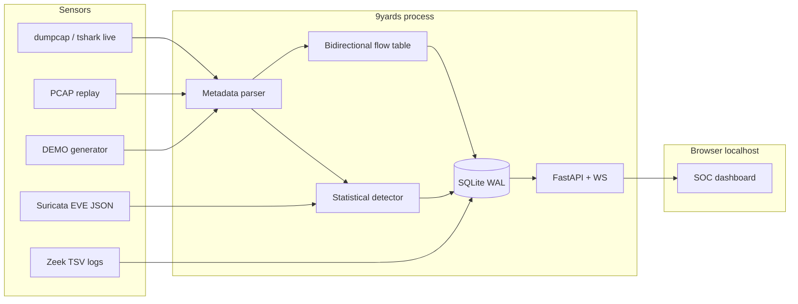

# Architecture

## Chosen stack (Kali 2026.3)

Inspected this host: `tshark`/`dumpcap`/`tcpdump` present, **Suricata and Zeek absent**, Docker present, Python 3.13 (conda) + 3.14 (system). Dumpcap is `cap_net_raw,cap_net_admin` and setgid `wireshark`; the current user is in that group.

Lightest path that still looks like a serious NIDS/statistical dashboard:

- **Python FastAPI + Uvicorn** (REST + WebSocket)
- **SQLite WAL** (packets, flows, alerts, KPI time series)
- **In-process statistical detector** (scans, SYN/ICMP/DNS bursts, elephant flows, beaconing, z-score volume)
- **Optional tails**: Suricata EVE JSON, Zeek conn/dns/http/ssl/notice/weird, syslog
- **Live tap**: `tshark -T fields` (metadata only). Optional rotating `dumpcap` files
- **Vanilla HTML/JS** dark SOC UI, charts drawn on canvas (no CDN, no Elasticsearch)

## Data model

### packets
Timestamp, MACs, VLAN, 5-tuple, IP TTL, length, TCP flags, L7 tag, SNI, JA3 (when ClientHello is parseable), retransmission flag, `info` (DNS qname / HTTP first line+Host). **No full payload by default.** Optional hex/ASCII cap in `packet_payloads`.

### flows
Zeek-style orig/resp: initiator, packets/bytes each direction, duration, start/end, OR’d TCP flags, derived TCP state, RST/SYN/FIN/retrans counts, L7/SNI/JA3.

### alerts
Severity, SID, signature, category, 5-tuple, count with dedup window, first/last seen, source (`stat` | `suricata` | `zeek` | `*-demo`), `is_demo`, ack/mute/comment, optional `flow_id` / `packet_id`.

### stats_ts
1s (live) or ~2s (demo) buckets: pps, bps, active/new flows, alert rate, unique hosts, kernel drops/errors.

### hosts
Per-IP first/last seen, bytes/packets in/out, alert count, recent ports.

## Privilege model

| Action | Need |
| --- | --- |
| DEMO / PCAP file ingest | Unprivileged |
| Live capture | `wireshark` group **or** root; dumpcap capabilities |
| Bind `127.0.0.1:8787` | Unprivileged |
| Bind `0.0.0.0` | Explicit `NIDS_BIND_PUBLIC=1` (discouraged) |

## Capture rotation

When `NIDS_STORE_PCAP=1`, dumpcap writes `data/capture/live.pcapng` with `-b filesize` / `-b files`. Directory mode `0700`. Dashboard ingest still uses metadata fields, not payload dumps.

## Correlation

Alert rows store `flow_id` when the detector saw the packet. The UI drills packet ↔ flow. Suricata/Zeek imported alerts correlate by 5-tuple + time window on the analyst’s next click (packet table filter).
