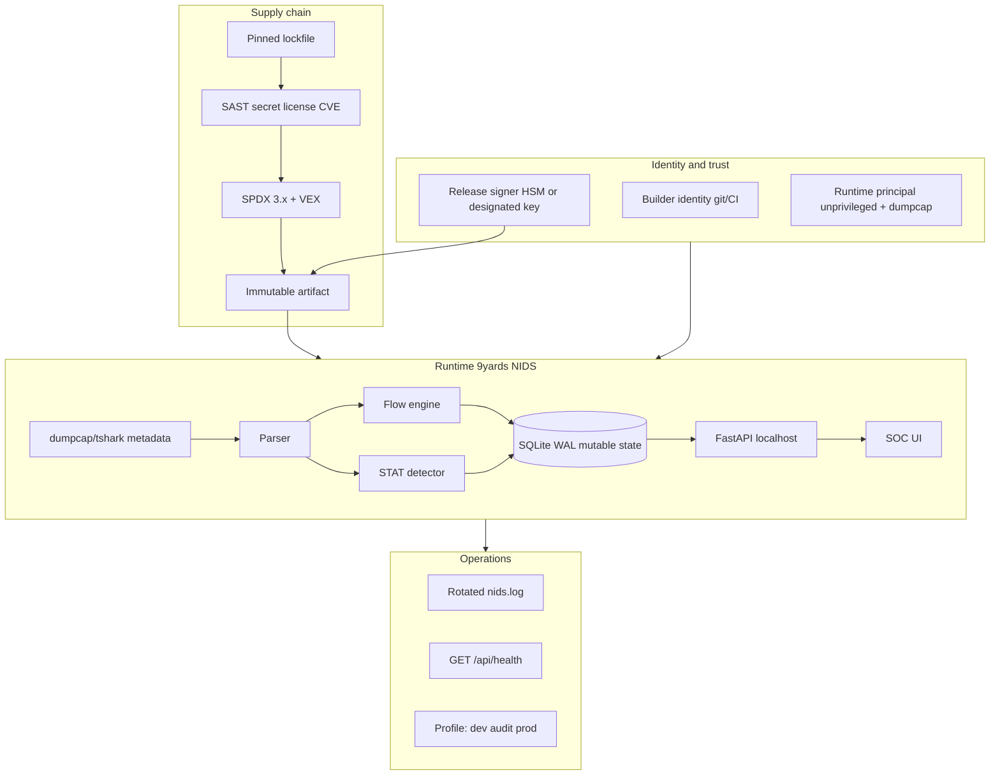
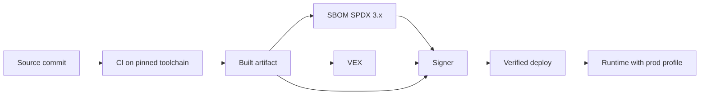
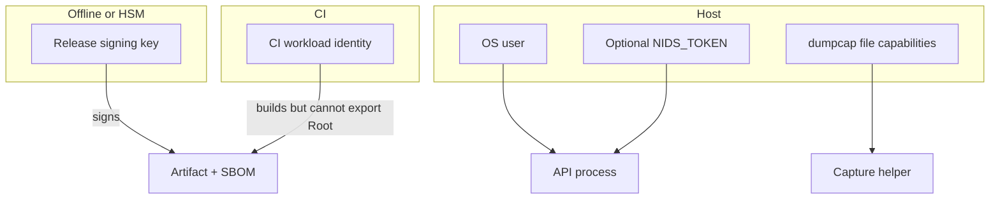

# 9yards NIDS — Requirements Analysis and High-Level Architecture

**Document ID:** 9YARDS-HLD-001  
**Version:** 0.1.0  
**Product:** 9yards NIDS 1.0.0  
**Date:** 2026-08-24  
**Status:** Engineering baseline — program-confirmable, not authorized  
**Related:** `../README.md`, `02-project-structure.md`, `03-compliance-traceability-seed.md`, `../conf/profiles.yml`, `../conf/sbom-policy.yml`

## 0. Authority and method

This document records **engineering requirements and architecture** for 9yards NIDS. It aligns *process and control selection* with publicly available NIST, CISA, and commercial standards. It does **not**:

- constitute an ATO, IATT, or IATO under NIST SP 800-37 Rev. 2 or DoDI 8510.01;
- assert that the deploying system is a National Security System (NSS) or apply CNSSI 1253 unless the program categorizes it as such;
- claim STIG certification;
- document collection techniques or classified ICD text beyond publicly citable identifiers (EO 12333 as a **design constraint** only).

NIST SP 800-37 Rev. 2 is used for **RMF process alignment** (categorize → select → implement → assess → authorize → monitor). Authorization remains a program/AO decision.

## 1. Product statement

9yards NIDS is a **defensive** network monitoring dashboard for SOC and laboratory use. It ingests packet **metadata**, bidirectional flows, and optional NSM logs (Suricata EVE JSON, Zeek TSV, syslog keywords), runs statistical detections, and presents packets, flows, alerts, hosts, protocols, diagrams, and capture health.

It is **not** an exploit framework, packet-injection tool, or full NSM stack (Suricata/Zeek/Arkime). Full payloads are **off** in the production profile.

**Current implementation (instance of this architecture):** Python FastAPI + Uvicorn, SQLite WAL, local HTML/JS UI bound to `127.0.0.1` by default, live capture via dumpcap/tshark metadata fields.

## 2. Stakeholders

| Role | Interest | Typical identity |
| --- | --- | --- |
| Product owner | Scope, residual risk, profile policy | Engineering lead |
| Maintainers / builders | Source integrity, CI, signed releases | Named git identities in CODEOWNERS |
| Signers | Release and SBOM authenticity | Offline or HSM-backed signing principal |
| SOC / lab operator | Detection utility, capture health | Local `operator` / `analyst` |
| Acquiring program (if USG) | RMF evidence, C-SCRM, SBOM 2026 | ISSO / SCA — **not this document** |
| End users of the monitored network | Privacy, purpose limitation | Not product users; IO constraint applies |

## 3. System categorization guidance (program-confirmable)

The **deploying program** confirms FIPS 199 / SP 800-60 impact. Suggested **starting point** for a localhost lab dashboard that stores packet metadata only:

| Security objective | Suggested impact | Rationale | Confirm if… |
| --- | --- | --- | --- |
| Confidentiality | **Low** (lab) / **Moderate** (enterprise tap) | Metadata (5-tuple, SNI, DNS qname, HTTP Host) can identify persons or orgs | Traffic includes operational or personally identifying network data |
| Integrity | **Moderate** | Tampered alerts or SBOMs mislead operators | Always |
| Availability | **Low** | Loss of the dashboard is operational inconvenience, not life-safety | Dashboard is on the critical path of a 24×7 SOC |

**Baseline selection (SP 800-53B):** Moderate baseline is the default recommendation when integrity is Moderate. The program may overlay high-water marks. **CNSSI 1253** applies **only** if the program categorizes the system as an NSS.

**DoDI 8510.01:** If the acquirer is U.S. Government, the program executes RMF in its own system of record. This baseline supplies *implementer evidence*, not eMASS import.

## 4. Scope of capabilities

| # | Capability | In scope for 9yards NIDS | N/A rationale if unused |
| --- | --- | --- | --- |
| 1 | Identity of builders, signers, runtime principals | **Yes** — git authorship, CI identity, optional `NIDS_TOKEN`, OS user for dumpcap | — |
| 2 | Integrity of source, build, artifacts | **Yes** — VCS, lockfile, signed release target | Signing not yet implemented; required in `audit`/`prod` profiles |
| 3 | Confidentiality of secrets and sensitive data | **Yes** — no secrets in git; TLS if exposed; payloads off by default | — |
| 4 | Least-privilege authorization | **Yes** — localhost default, optional token, capture caps only on dumpcap | Fine-grained RBAC is a gap (see open items) |
| 5 | Secure defaults in production profile | **Yes** — bind localhost, no payload store, no public bind | — |
| 6 | SBOM 2026 + C-SCRM intake | **Yes** — required for published artifacts | Pipeline not yet emitting SPDX 3.x; policy defined |
| 7 | Signed authenticated update/deploy with rollback | **Target** — versioned venv/container; rollback = prior immutable tag | No auto-updater in v1.0.0; documented as operator redeploy |
| 8 | Logging/audit with minimization | **Yes** — rotating app log, operator ack/mute; no USP purpose | Operator identity on ack/mute is a gap |
| 9 | Testable control implementations | **Yes** — smoke tests, health endpoint, profile contract tests | Compliance scanner increment later |

## 5. Security-relevant functional requirements

IDs `FR-n` map to primary NIST SP 800-53 Rev. 5 families and SSDF practices. Test IDs are seeds (`T-n`) for the later validation plan.

| ID | Requirement | Primary controls | SSDF | Test seed |
| --- | --- | --- | --- | --- |
| FR-01 | Production profile binds loopback only unless an explicit, reviewed override exists | SC-7, CM-6, CM-7 | PW.9 | T-BIND |
| FR-02 | Full payloads are not stored unless `payload_enabled` is on in a non-prod profile or an auditable exception | SI-12, AU-11, PM-25 | PW.5 | T-PAY |
| FR-03 | Capture files and DB directory are created with restrictive mode (0700 / 0600 intent) | AC-3, SC-28 | PW.9 | T-FS |
| FR-04 | Live capture uses the least privilege that still sniffs (dumpcap capabilities / `wireshark` group); API process is unprivileged | AC-6, AC-5 | PW.1 | T-CAP |
| FR-05 | Optional API token (`NIDS_TOKEN`) is enforced on `/api/*` except `/api/health` when set; never committed | IA-5, AC-3, SC-12 | PS.1 | T-TOK |
| FR-06 | DEMO data is labeled `is_demo` and shown as **DEMO** in the UI | SI-10, AU-10 | RV.1 | T-DEMO |
| FR-07 | Health endpoint reports bind, capture status, drops, tool inventory without secrets | SI-4, AU-12, CA-7 | RV.1 | T-HLTH |
| FR-08 | Logs rotate and do not include payloads or tokens | AU-2, AU-3, AU-11 | PW.8 | T-LOG |
| FR-09 | Dependencies are pinned for `audit`/`prod` releases; no floating ranges on release branches | SA-15, SR-3, CM-2 | PS.3, PW.4 | T-PIN |
| FR-10 | Published releases include a signed SPDX 3.x SBOM meeting CISA 2026 minimum elements and VEX for known CVEs | SR-4, SA-15, SI-5 | PS.3, PW.4 | T-SBOM |
| FR-11 | Release artifacts (wheel/container/tarball + SBOM) are signed; verification is documented | SA-10, SC-13, CM-5 | PS.2, PW.6 | T-SIG |
| FR-12 | Operator actions that change alert state (ack/mute/comment) are attributable | AU-3, AU-9, AC-2 | PW.8 | T-ACK |
| FR-13 | Geo mapping of public IPs is off unless a local GeoLite2-class DB is present; private addresses are never geolocated | SI-12, PM-25 | PW.5 | T-GEO |
| FR-14 | Ingest paths (PCAP upload, EVE/Zeek tail) validate size/type and do not execute content | SI-10, SI-3, SR-11 | PW.4 | T-ING |
| FR-15 | Fail closed in prod (refuse public bind, unsigned promote, missing SBOM); fail observable in dev | CM-6, SI-17 | PW.9 | T-FAIL |

## 6. Non-functional requirements

| ID | Requirement |
| --- | --- |
| NFR-01 | Lab-scale ingest: tens of thousands of metadata rows; not a 10 Gbps full-PCAP ring |
| NFR-02 | UI usable across a desk (base type ≥16px); no debug consoles in prod profile |
| NFR-03 | Single-process SQLite is acceptable for lab; HA is out of increment |
| NFR-04 | Rebuild/redeploy to change profile; no silent weakening of prod via local override files shipped in the artifact |
| NFR-05 | Evidence (SBOM, VEX, test reports, signatures) generated **in the same pipeline** as the artifact |

## 7. Constraints and assumptions

1. Operators may hold `CAP_NET_RAW` via dumpcap; the dashboard process must not require root in prod.
2. Suricata and Zeek are **optional sensors**, not bundled engines.
3. No Elasticsearch; local SQLite is the system of record for the dashboard.
4. No dual-use foundation model or generative AI component in v1.0.0 → NIST SP 800-218A and CISA/G7 SBOM-for-AI **do not apply** until such a component is added (see §16).
5. Digital identity is a **bearer token or OS user**, not a full IdP → NIST SP 800-63 requirements apply when the program adds phishing-resistant authentication for any non-loopback admin interface.
6. The product does not perform USP collection as a mission. Packet metadata **may incidentally** identify persons (IP, SNI, DNS, HTTP Host). IO design: purpose limitation, minimization, default no payload, access control, audit.

## 8. Domain standards applicability

| Standard | Applies? | Rationale |
| --- | --- | --- |
| NIST SP 800-53 Rev. 5 / 53B | **Yes** | Control catalog after categorization |
| NIST SP 800-37 Rev. 2 | **Process only** | RMF steps; no AO decision here |
| NIST SP 800-218 SSDF v1.1 | **Yes** | Secure software development |
| NIST SP 800-218A | **No (v1.0.0)** | No generative AI / dual-use FM; re-open if added |
| NIST SP 800-161 Rev. 1 | **Yes** | Third-party Python/OS packages, tshark/dumpcap |
| NIST SP 800-204 series | **Deferred** | Monolith today; apply if split into microservices |
| NIST SP 800-63 | **Conditional** | When exposing authenticated admin off-loopback |
| CISA Secure by Design | **Yes** | Memory-safe language (Python) for app logic; secure defaults; customer evidence |
| CISA 2026 SBOM minimum elements | **Yes** for published artifacts | SPDX 3.x primary; CycloneDX optional |
| SPDX 3.x / CycloneDX / VEX | **Yes** | SPDX required; CycloneDX interchange optional |
| CISA/G7 SBOM-for-AI | **No (v1.0.0)** | No AI model artifact |
| DoDI 8510.01 | **If USG acquirer** | Program RMF, not this baseline’s ATO |
| SRGs/STIGs | **Technical benchmarks only** | Do not claim “STIG certified” |
| CNSSI 1253 | **Only if NSS** | Program categorization |
| ISO/IEC/IEEE 12207, 15288 | **Yes (process mapping)** | Life cycle processes analog |
| ISO/IEC/IEEE 29119 | **Yes (test process)** | Later testing increment |
| ISO/IEC 27001, 27034 | **Guidance** | Org ISMS/application security; no cert claim |
| IEC 62443-4-1/4-2 | **No** | Not an industrial automation product |
| ISO/SAE 21434 | **No** | Not automotive software |
| ISO 13485 / IEC 62304 | **No** | Not a medical device |
| OpenChain ISO/IEC 5230 | **Target** | License compliance program for published releases |
| CERT C/C++ | **No** | No first-party C/C++ in the app (Wireshark is third-party OS) |
| OWASP ASVS | **Yes** | Local web UI + API |

## 9. Logical architecture

### 9.1 Identity and trust

| Principal | Authenticates as | Privilege |
| --- | --- | --- |
| Builder | Git commit + CI job identity | Write source; cannot sign prod |
| Signer | Detached signing key / PKCS#11 | Sign artifacts and SBOMs only |
| Runtime API | OS user, optional `NIDS_TOKEN` | No raw capture caps |
| Packet capture | dumpcap (file caps / group) | `CAP_NET_RAW` / `CAP_NET_ADMIN` only on that binary |
| Operator | Local browser on loopback; optional bearer token | Read telemetry; ack/mute alerts |

Separation: the API process **must not** be the same binary that holds raw-socket capabilities.

### 9.2 Supply chain

Allowlisted indexes/mirrors; pinned hashes for `audit`/`prod`; third-party intake record for FastAPI, Uvicorn, Wireshark/tshark, Python. Air-gap path: vendor a private wheelhouse and OS package mirror. See `02-project-structure.md`.

### 9.3 Runtime

Immutable: application code, `conf/profiles.yml` baked at build, UI static files.  
Mutable: `data/nids.db`, `data/nids.log`, optional `data/capture/*.pcapng`, operator ack/mute.

Default deny: public bind off; payload store off; admin-equivalent surfaces (payload viewer, PCAP store, public bind) require profile or explicit exception.

### 9.4 Operations

Health and logs exist for **integrity, reliability, safety, and cybersecurity** of the sensor and dashboard — not to collect information about U.S. persons.

## 10. Trust chain

Compromise of CI without signer isolation is a **high** residual risk until signing is offline or HSM-backed (SA-10, SR-9).

## 11. Data and state model

| Store | Mutability | Sensitivity | IO note |
| --- | --- | --- | --- |
| `packets` | Mutable, capped | Network metadata (IPs, ports, SNI, DNS qname, HTTP Host) | May incidentally identify persons; no payload by default |
| `packet_payloads` | Off in prod | Hex/ASCII cap | Residual USP risk if enabled — document exception |
| `flows` / `hosts` / `stats_ts` | Mutable, capped | Aggregates | Minimized vs full packets |
| `alerts` | Mutable | Signatures + 5-tuple; ack/mute/comment | Accountability, not collection |
| `kv` / `sensor` | Mutable | Runtime settings, iface name | No secrets |
| App log | Rotating | Errors, start/stop | No tokens, no payloads |
| Capture PCAP | Off in prod unless exception | Frames | Highest incidental USP risk |

**DEMO corpus** uses documentation prefixes (e.g. `203.0.113.0/24`) and RFC1918 lab nets; labeled `is_demo=1`.

## 12. Component and authorization model

| Component | Trust | Authorizes |
| --- | --- | --- |
| UI static files | Untrusted client | None; same-origin to API |
| FastAPI | TCB for policy | Token middleware, payload gate, bind address |
| SQLite | TCB for integrity of local state | File permissions |
| dumpcap/tshark | TCB for capture | OS caps / group |
| STAT detector | Not a crypto boundary | Writes alerts only |
| Optional EVE/Zeek tail | Treat files as untrusted input | Parse, do not execute |

Authorization policy (enforceable):

- Loopback listener in prod.
- If `NIDS_TOKEN` set: bearer or `X-NIDS-Token` on API except health.
- Payload route returns 403 unless profile allows storage.
- No anonymous write to disk outside `data/` owned by the runtime user.

Gap: ack/mute is not bound to a named operator unless token or reverse-proxy identity is introduced (FR-12).

## 13. Networking and exposure

| Interface | Prod default | Notes |
| --- | --- | --- |
| HTTP UI/API | `127.0.0.1:8787` | `NIDS_BIND_PUBLIC` forbidden in prod profile |
| WebSocket `/ws/live` | Same bind | KPI ticks only |
| Live capture | Local NICs via dumpcap | BPF optional |
| EVE/Zeek/syslog | Local files | No remote syslog listener in v1 |
| Outbound | None required | No GeoIP network fetch |

If a reverse proxy is added, it is **outside** this TCB unless the program includes it; require TLS and phishing-resistant admin auth (800-63) before leaving loopback.

## 14. Identity and key hierarchy

Rules:

- Secrets never in git (IA-5(7), SA-8).
- Prod signing keys never on developer laptops.
- `NIDS_TOKEN` from environment or secret manager, not `data/`.
- No key-ceremony procedures that expose live HSM material in this increment.

## 15. Observability and Intelligence Oversight

**Purpose (allowed):** detect integrity failures, sensor drops, abuse of the dashboard, and cyber events on networks the operator is authorized to monitor.

**Purpose (forbidden by design):** using 9yards NIDS to collect, retain, or report information about U.S. persons beyond what is necessary to operate and account for the product.

| Control | Implementation |
| --- | --- |
| Purpose limitation | Product docs and UI state the mission is defensive telemetry |
| Data minimization | Metadata fields only; payload off; pruning caps; DEMO labeled |
| No USP collection by default | No identity store of persons; no geo of RFC1918; no full content |
| Access control | Loopback; optional token; file mode 0700 on `data/` |
| Audit | Rotating log; future operator ID on ack/mute |
| Residual risk | Enabling payload store, public bind, or PCAP retention **may** capture USP-identifying content; must be an auditable profile exception |

This section cites **EO 12333 as a publicly citable identifier** only. It does not reproduce implementing IC directives.

## 16. Update and recovery

v1.0.0 has **no auto-updater**. Recovery property:

- Releases are **immutable tags** (git + artifact digest).
- Rollback = deploy previous signed artifact and matching SBOM.
- Database is not part of the signed artifact; backup/restore is operator procedure (`data/nids.db`).
- Failed capture: API remains up; health shows `last_error` (fail observable). Prod still refuses unsigned promote (fail closed at pipeline).

## 17. Threat model (minimum)

**Assets:** source and CI; signing keys; released artifacts and SBOMs; runtime token; SQLite and optional PCAPs; customer/mission packet metadata; audit trail authenticity.

**Adversaries:** dependency implant; compromised maintainer or CI; network attacker on a non-loopback bind; malicious insider with shell; physical theft of the lab disk (where in scope).

| STRIDE | Example against 9yards NIDS | Mitigations |
| --- | --- | --- |
| Spoofing | Fake UI origin or token replay | Loopback, optional token, later mTLS/proxy |
| Tampering | Modified wheel or injected JS | Signed artifacts, no CDN in UI, Subresource integrity N/A (local static) |
| Repudiation | Anonymous ack of alerts | FR-12 operator identity (gap) |
| Information disclosure | Payload or public bind | Prod profile; payload 403; no secrets in logs |
| Denial of service | Unbounded PCAP upload / DB growth | 80 MB upload cap, row prune, bind local |
| Elevation | API process gains raw sockets | dumpcap-only caps; unprivileged API |

## 18. Security decisions and trade-offs

| Decision | Choice | Benefit | Cost / residual risk | Compliance |
| --- | --- | --- | --- | --- |
| Language | Python 3 for app TCB | Memory-safe for dashboard logic | Interpreter supply chain | CISA SbD; SI-16 analog |
| Capture helper | dumpcap, not root API | Least privilege | Host must be hardened | AC-6 |
| Datastore | SQLite WAL | Simple TCB, no extra server | Not multi-node | SC-7 reduction |
| Default bind | 127.0.0.1 | No network exposure | Remote SOC needs a reviewed proxy | SC-7, CM-7 |
| Payloads | Off | IO minimization | Less forensic depth | PM-25, SI-12 |
| Detector | Statistical heuristics | No exploit content | False positives | SI-4 |
| SBOM | SPDX 3.x in pipeline (target) | 2026 elements | Not yet automated in v1.0.0 tree | SR-4, CISA 2026 |
| AuthN | Optional token | Fits lab | Insufficient for enterprise expose | IA-2 gap until 800-63 |
| Updates | Manual tagged deploy | Simple rollback | No signed-in-app updater | CM-3, SI-2 process |

## 19. Architecture-level compliance alignment

### SSDF (NIST SP 800-218 v1.1)

| Group | How this architecture satisfies |
| --- | --- |
| PO | Roles (builder/signer/operator) separated; security requirements FR-* ; profiles as org policy |
| PS | Pinned deps; secret scanning; third-party intake (800-161); signed artifacts in audit/prod |
| PW | Secure defaults; threat model; SAST; hermetic release; no undocumented prod weakening |
| RV | Health, logs, VEX, vulnerability response via dependency updates |

### NIST SP 800-53 families ( Moderate-oriented )

AC (least privilege, localhost), AU (logs, future attribution), CA (continuous health), CM (profiles, pinning), IA (token/OS user), RA (threat model), SA (SSDF pipeline), SC (bind, no payload, future TLS at proxy), SI (integrity of parse path, DEMO labeling, vuln VEX), SR (SBOM, allowlist, VEX), PM-25 (minimization).

### CISA Secure by Design

Memory-safe application language; secure defaults (bind, payload, DEMO labels); evidence (SBOM, signatures) as a customer-ready artifact — **once the pipeline in `02-project-structure.md` is implemented**.

### Intelligence Oversight principles

Purpose limitation, minimization, default-deny content capture, access control, audit. Optional modules (payload viewer, PCAP store, public bind) carry **documented residual USP risk**.

## 20. Open items for a product annex

1. Implement SPDX 3.x generation and signing in CI (currently policy-only).
2. Bind ack/mute to an operator identifier (FR-12).
3. Reverse-proxy pattern with phishing-resistant MFA if leaving loopback (800-63).
4. Confirm FIPS 199 impact with the deploying program.
5. Third-party intake records for FastAPI, Uvicorn, Wireshark.
6. Decide container vs venv as the immutable prod artifact.
7. If generative AI is ever added: open SP 800-218A and SBOM-for-AI annex.
8. NSS overlay (CNSSI 1253) only if the program so categorizes.
9. Backup/restore procedure for `data/nids.db` without including secrets.
10. Full control-enhancement and test-ID traceability (increment).

---

*End of 9YARDS-HLD-001 v0.1.0*
