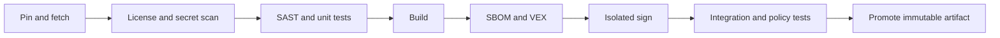

# 9yards NIDS — Recommended Project Structure

**Document ID:** 9YARDS-STR-001  
**Version:** 0.1.0  
**Date:** 2026-08-24  
**Status:** Engineering baseline  
**Related:** `01-requirements-and-architecture.md`, `../conf/profiles.yml`, `../conf/sbom-policy.yml`

This document maps a **secure development topology** onto 9yards NIDS. Paths are relative to `/workspace/project` (substitute the actual checkout).

## 1. Repository topology

Recommended **single product repository** (current layout extended, not replaced):

```text
/workspace/project/
  README.md
  LICENSE
  VERSION                         # product version (exists as nids/version.py today)
  CODEOWNERS
  SECURITY.md
  .gitignore                      # secrets, data/, .venv, keys
  requirements.txt                # lock later: requirements.lock / uv.lock / pdm.lock
  start.sh
  nids/                           # first-party runtime (immutable code)
  web/                            # first-party UI static
  sample/                         # DEMO corpus (labeled)
  tests/
  docs/                           # operator + architecture (existing)
  secure-software-baseline/       # this package
    README.md
    VERSION
    docs/
    conf/
      profiles.yml
      sbom-policy.yml
  conf/                           # product profile instantiation (symlink or copy)
    profiles.yml
    sbom-policy.yml
  evidence/                       # gitignored; CI uploads as artifacts
  third-party/                    # intake records (not vendor source)
    intake/
  scripts/                        # capture helpers (already present)
```

**Ownership boundaries**

| Path | Owner | May change prod policy? |
| --- | --- | --- |
| `nids/`, `web/` | Maintainers | No (code review + CI) |
| `secure-software-baseline/conf/` | Security reviewer + maintainer | Yes, via review |
| `sample/` | Maintainers | DEMO only |
| `data/` | Runtime (not in git) | N/A |
| Signing keys | Signer role | Never in repo |

Do **not** store `data/nids.db`, capture files, `.venv`, or tokens in version control.

## 2. Configuration design

Production settings live in **reviewed files** (`conf/profiles.yml`), not in untracked developer overrides that ship inside the artifact.

| Profile | How it is applied |
| --- | --- |
| `dev` | Local env / `--profile dev`; signing optional |
| `audit` | CI and staging images; signing required |
| `prod` | Release image/tag; signing + SBOM required; floating deps forbidden |

Changing profile requires **rebuild or redeploy**, not a silent runtime toggle that disables enforcement in a prod artifact.

Developer-local files (e.g. `.env`) must be gitignored and **must not** be copied into release artifacts (CM-6, CM-7).

Instantiation example (illustrative):

```bash
# substitute your actual path
export NIDS_PROFILE=prod
python -m nids --profile "${NIDS_PROFILE}"
```

The loader SHALL refuse `prod` if:

- bind host is not loopback;
- `payload_enabled` is true without a documented exception file that is **not** the default;
- lockfile is absent;
- SBOM sidecar is absent for a published artifact.

## 3. Evidence the pipeline must emit

Store next to the artifact (same directory or attested digest link):

| Evidence | Format | Signed? |
| --- | --- | --- |
| Application artifact | wheel, sdist, and/or container digest | `audit`/`prod` |
| SBOM | SPDX 3.x JSON (CycloneDX optional extra) | Yes for `audit`/`prod` |
| VEX | CSAF VEX or CycloneDX VEX | Yes when published |
| Tool versions | `evidence/tool-versions.txt` | Checksum with build log |
| Test report | JUnit / JSON | Build attestation |
| SAST + secret scan | SARIF | Build attestation |
| License scan | JSON | Build attestation |
| Profile used | copy of `conf/profiles.yml` + selected name | With artifact |

## 4. CI/CD stages



| Stage | Controls | Fail closed (prod) |
| --- | --- | --- |
| Pin and fetch | Allowlisted index; lockfile; recorded tool versions | Unpinned dep |
| License + secret scan | No committed secrets; license policy | Secret finding, forbidden license |
| SAST + unit | First-party and tests | High SAST on release branch |
| Build | Reproducible as far as Python allows; no network in hermetic job | Network fetch during build |
| SBOM + VEX | CISA 2026 elements; full transitive | Missing component hash or license |
| Isolated sign | Separate job/identity; HSM or protected key | Signer on same identity as builder (policy warn in audit, fail in prod) |
| Integration + policy | Profile contract tests T-* | Prod profile violation |
| Promote | Immutable tag + digest | Moving a mutable `latest` without digest |

Illustrative CI sketch (not a vendor lock-in):

```yaml
# .github/workflows/release.yml  (illustrative)
jobs:
  build:
    steps:
      - uses: actions/checkout@<pinned-sha>
      - name: Install pinned toolchain
        run: python -m pip install --require-hashes -r requirements.lock
      - name: Secret and license scan
        run: echo "invoke scanner; fail on findings"
      - name: SAST and unit
        run: python -m unittest tests/test_smoke.py
      - name: Build
        run: python -m build
      - name: SBOM
        run: echo "syft or cdxgen equivalent → SPDX 3 JSON"
      - name: Policy test
        run: python scripts/check_profile.py --profile prod
  sign:
    needs: build
    environment: release-signing
    steps:
      - name: Sign artifact and SBOM
        run: echo "cosign or gpg --detach-sign via PKCS#11"
```

Replace action tags with **commit SHAs**. Do not use floating `@v4` on release branches.

## 5. Supply-chain controls (NIST SP 800-161 Rev. 1)

| Control | Practice |
| --- | --- |
| Allowlisted sources | PyPI or private mirror only; OS packages from distro mirror |
| No floating versions on release branches | Hash-pinned lockfile |
| Third-party intake | `third-party/intake/<component>.md`: supplier, version, license, hash, maintainer risk |
| Air-gap | Vendor wheels + `pip --no-index --find-links` |
| Wireshark/tshark | Treated as OS component; record package version in SBOM via system inventory |
| DEMO PCAP | First-party synthetic; still listed in SBOM as data file with hash |

Intake record skeleton:

```markdown
# Intake: fastapi
- Producer: Encode / FastAPI project
- Version: <pinned>
- Hash: sha256:...
- License: MIT
- Source: allowlisted index
- Declared CVEs / VEX: see evidence/vex.json
- Decision: accept for prod profile
```

## 6. Mapping current tree → target

| Current | Target action |
| --- | --- |
| `requirements.txt` with ranges | Add `requirements.lock` with hashes for prod |
| No signing | Add isolated sign job |
| No SPDX | Generate on release |
| `NIDS_*` env vars | Bind to `conf/profiles.yml` |
| `data/` gitignored | Keep gitignored; document backup |
| Localhost default | Keep as prod default |
| Smoke tests | Expand T-* policy tests |

## 7. CODEOWNERS (illustrative)

```text
/secure-software-baseline/conf/  @security-reviewer @maintainer
/nids/                           @maintainer
/web/                            @maintainer
/requirements.lock               @maintainer @security-reviewer
```

Use actual project aliases; do not commit personal emails.

---

*End of 9YARDS-STR-001 v0.1.0*
